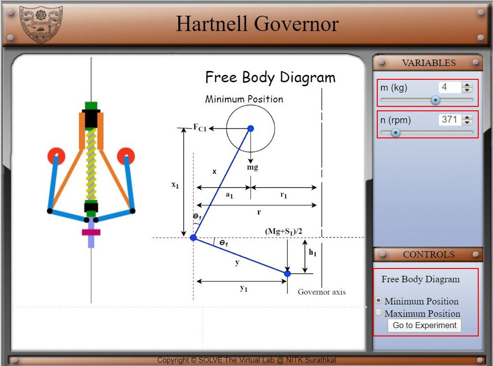
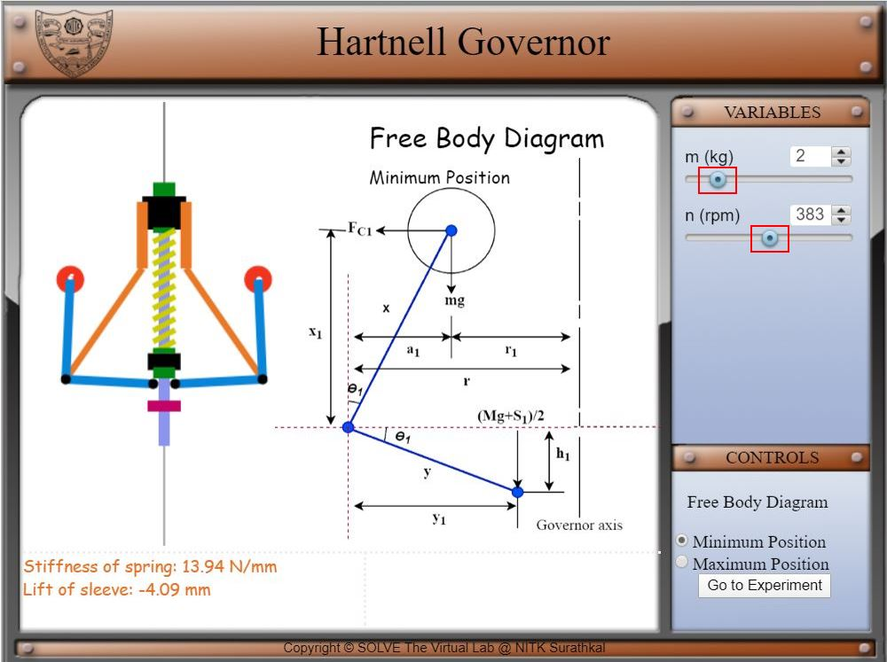
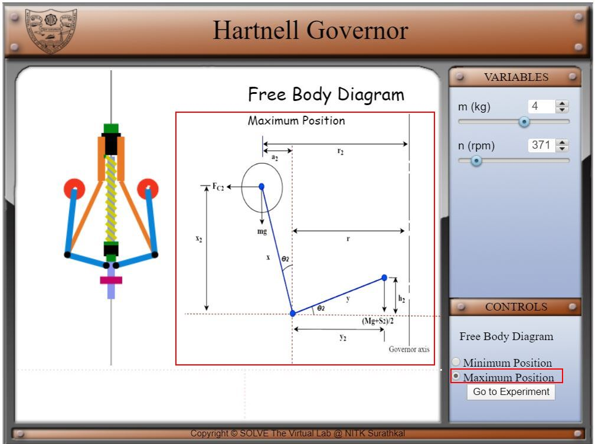
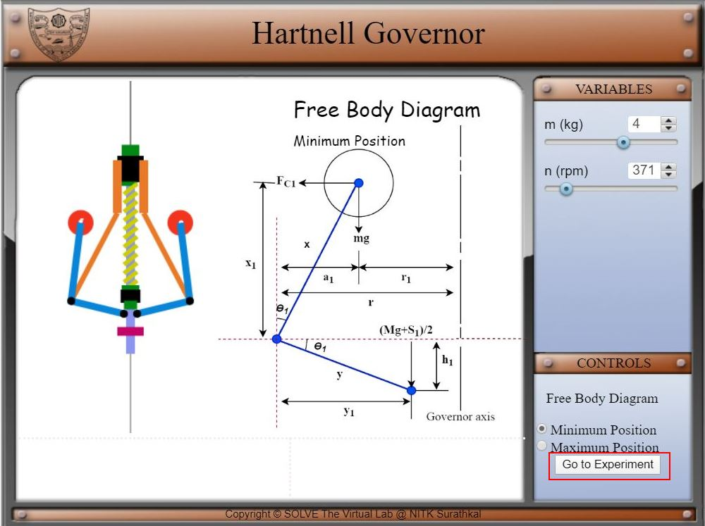
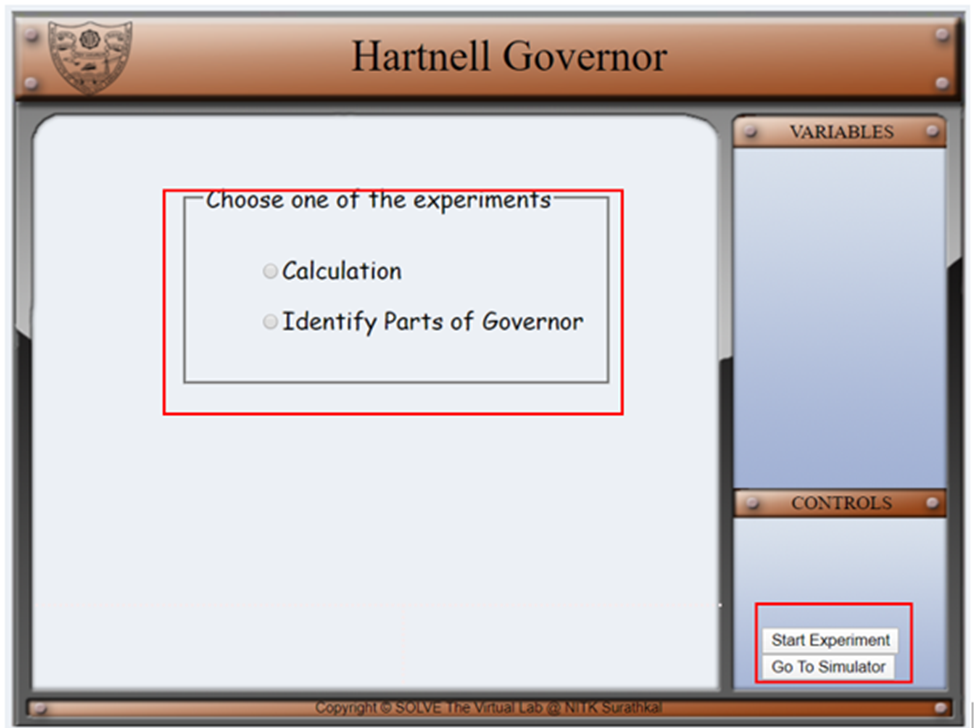
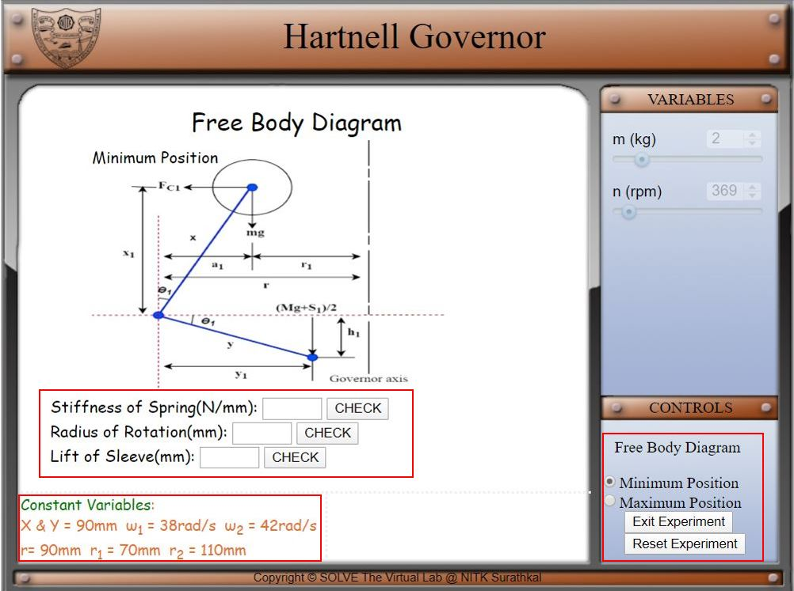
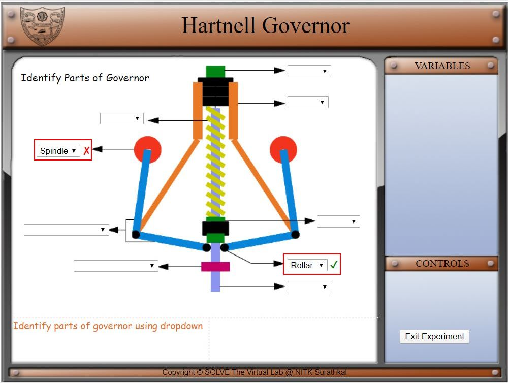

#### These procedure steps will be followed on the simulator

1. On simulation window front, top view and free-body diagram of Hartnell governor is displayed. 

2. Speed control and mass control pointer is given in variable tab, in the control tab two checkboxes are given for displaying free-body diagram at **Minimum Position** and **Maximum Position** and a button **Go to Experiment** for going to experiment page. 
 

3. Move the slider knob to the right, this causes the rotational speed to change from 365 to 400 rpm. Move the slider knob to the right, this causes the mass to change from 1 to 6 kg. 
 

4. When **Maximum Position** checkbox is checked, a free body diagram of the maximum position will appear on the simulation screen.  
 

5. For the experiments select **Go to Experiment** in the control panel  
 

6. On the experiment page on the simulator user can select two experiment, calculation or identifying the parts on the simulator screen. Control panel can be used to start the experiment or go back to the simulation. 
 

7. In the calculation experiment, constant variables, minimum and maximum position free body diagram (can be chosen from control tab) is given for the calculation of the stiffness of spring, radius of rotation, and lift of sleeve. User can verify the calculation in the check box. User can use the **Reset Experiment** option in the control panel to reset the experiment for new calculation. For going back to choose the experiment **Exit Experiment** button can be used in control panel. 
 

8. In the identify parts of the governor experiment, a Hartnell governor  setup in the middle of the simulation screen, different parts of the governor have the dropdown box where user can choose the part name and verify at the same time. 
 
