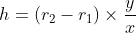

## INTRODUCTION 

#### Learning Objectives:

  1. Define the significance of hartnell governor
  2. Identify the parts of a hartnell governor such as ball, spindle, bell crank lever, sleeve, roller and spring
  3. Explain the working and uses of hartnell governor
  4. Calculate/derive governing equation of the hartnell governor
  5. Examine the variation in the length of the bell crank lever, height of sleeve, mass of the ball, and stiffness of the spring due to change in rotational speed.

#### Theory
Governors, in general, are most useful means of controlling or regulating the speed of an engine based on varying levels of the load at the output. They are used in regulating the speed of the engine, which takes to the fact that the fuel injected is based on the speed variations seen along the shafts. <a href="references.html">[1]</a>
          

Source: (<a href="http://www.jptechnoindia.com/theory_of_machine.html">http://www.jptechnoindia.com/theory_of_machine.html</a>)

Hartnell governor is spring controlled governor. Two bell crank levers, each carrying a ball at one end and a roller on the other end. The roller fit into a groove in the sleeve. The frame is attached to the governor spindle and hence rotates with it. A helical spring in compression provides equal downward forces on the two rollers through a collar on the sleeve. With increase in speed, radius of rotation of balls increases and rollers lift the sleeve against the spring force. With decrease in speed, sleeve move downwards with the spring force. The movement of this sleeve is transferred to throttle valve.<a href="references.html">[1]</a>

#### Equations/formulas:
 Mass of each ball (kg)

 Mass of central load (N)

 Height of governor (m)

 Minimum radius of rotation (m)

 Maximum radius of rotation (m)

 Angular speed of the governor at minimum radius (rad/s)

 Angular speed of the governor at maximum radius (rad/s)

 Spring force exerted on the sleeve at  (N)

 Spring force exerted on the sleeve at (N)

 Centrifugal force at (N)

 Centrifugal force at (N)

 Stiffness of the spring or the force required to compress the spring by a unit distance

 Length of the vertical or ball arm of the lever (m)

 Length of the horizontal or sleeve arm of the lever (m)

 Distance of fulcrum  from the governor axis or the radius of rotation when the the governor is in mid-position (m)

 

The stiffness of the spring is obtained as:

 

The distance of the ball from the centre:

 

 

(Equations Source: <a href="http://latex.codecogs.com/">latex.codecogs.com</a>)

